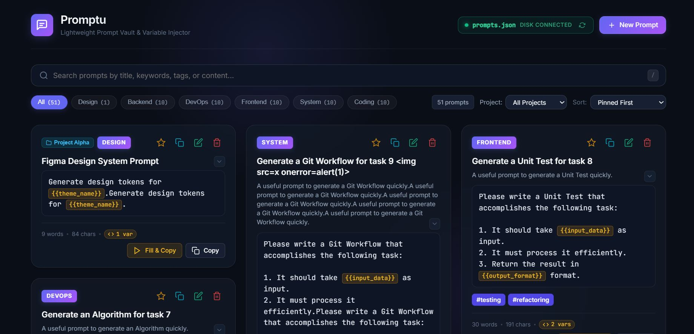

# Promptu

<div align="center">



**An ultra-lightweight, zero-dependency local prompt vault, template engine, and multi-project manager for AI workflows.**

[](package.json)
[](LICENSE)
[](https://nodejs.org/)
[](prompts.json)
[](#privacy--security)

</div>

---

## 🌟 Overview

**Promptu** is a privacy-first, lightning-fast personal prompt library designed for AI engineers, developers, writers, and prompt crafters. 

Unlike cloud-dependent prompt managers, **Promptu stores 100% of your data locally on your own machine** in a human-readable JSON file. It requires **zero external npm dependencies**, boots in milliseconds, and provides a sleek glassmorphic UI with dynamic templating, multi-project scoping, and command palette navigation.

---

## ✨ Features

- **📁 Multi-Project & Workspace Organization**: Group prompts into distinct projects or client workspaces. Filter by project via the top controls dropdown or by clicking any card's project badge.
- **⚡ Dynamic Template Variables (`{{variable}}`)**: Write reusable prompt templates with variable placeholders (e.g. `{{code_language}}`, `{{theme_name}}`). Clicking copy opens an interactive modal to fill in values with live preview.
- **⌨️ Command Palette (`Ctrl+K` / `Cmd+K`)**: Rapid keyboard-driven navigation to search prompts, switch project scopes, filter categories, view statistics, and clear active filters.
- **🔒 Absolute Privacy & Local-First**: No tracking, no telemetry, no cloud sync, and no vendor lock-in. Everything is saved directly to your local `prompts.json` file.
- **🚀 Zero Dependencies**: Built with pure native Node.js and Vanilla JS/CSS/HTML. No massive `node_modules` folder, no build steps, and no bundling required.
- **🛡️ Built-in Security & XSS Protection**: Strict sanitization across all user inputs, titles, tags, projects, and descriptions, combined with rigorous Content Security Policy (CSP) headers.
- **📋 Dual-Fallback Copy Engine**: Works seamlessly in modern browser clipboard environments and fallback execution contexts.
- **🧩 Dynamic Masonry Layout & Snippet Collapse**: Clean card grid layout with expand/collapse toggles for long prompts and instant height recalculations.
- **🏷️ Interactive Tags & Scoped Category Chips**: Click any tag to filter the entire library instantly. Category counts dynamically update based on the active project.
- **💾 Import & Export**: One-click JSON backup and restore with duplicate detection and conflict handling.
- **⭐ Pinning & Usage Tracking**: Pin your go-to prompts to the top and track usage frequency automatically.
- **🔄 Auto-Shutdown**: Automatically shuts down the local server when you close the browser tab to keep your system resources clean.
- **🖥️ Silent Background Launchers**: Includes dedicated single-click background launchers for Windows (`.vbs`), macOS (`.command`), and Linux (`.sh`).

---

## 🚀 Getting Started

### Prerequisites

- [Node.js](https://nodejs.org/) (version 14 or higher) installed on your machine.

### Installation

Clone the repository:

```bash
git clone https://github.com/irahulmali/Promptu.git
cd Promptu
```

---

## 💻 Running Promptu

### Option 1: Standard Terminal Launch (All Platforms)

Run the local server directly:

```bash
npm start
# or: node server.js
```

Promptu will start at `http://localhost:3333` and automatically open your default browser.

---

### Option 2: Run Silently in the Background

Run Promptu without keeping an open terminal window:

#### 🪟 Windows
Double-click **`Promptu.vbs`**. It starts the Node server in the background and opens the web application without leaving a command prompt open.

#### 🍎 macOS
1. Make the script executable once:
   ```bash
   chmod +x start-mac.command
   ```
2. Double-click **`start-mac.command`** in Finder anytime you want to launch Promptu.

#### 🐧 Linux
1. Make the script executable once:
   ```bash
   chmod +x start-linux.sh
   ```
2. Run `./start-linux.sh` or double-click it in your file manager.

---

## ⌨️ Keyboard Shortcuts

| Shortcut | Action |
| :--- | :--- |
| `Ctrl + K` or `Cmd + K` | Open Command Palette |
| `/` | Focus search bar |
| `Esc` | Close active modal / clear palette |
| `Enter` | Submit modal / confirm action |

---

## 🧩 Template Variables Guide

You can turn any prompt into an interactive template by wrapping placeholder variable names in double curly braces:

```text
Please refactor the following {{language}} code to adhere to {{design_pattern}}:

{{code_snippet}}
```

When you click **Copy** on this card:
1. Promptu automatically detects `language`, `design_pattern`, and `code_snippet`.
2. An interactive variable-filling modal appears.
3. As you type, a real-time preview updates instantly.
4. Click **Copy Prompt** or press `Enter` to copy the resolved text directly to your clipboard.

---

## 📁 Multi-Project Workspaces

Keep client work, personal side-projects, and engineering prompts neatly partitioned:
- Assign any prompt to a project (e.g. `Design Systems`, `Backend API`, `Client-Acme`).
- Use the **Project** dropdown in the top controls bar to view only prompts in that workspace.
- Click the **📁 Project Badge** on any card to filter by that project in one click.
- Switch or clear projects instantly from the **Command Palette (`Ctrl+K`)**.

---

## 📂 Architecture & Project Structure

```text
Promptu/
├── assets/
│   └── screenshot.jpg        # Preview asset for documentation
├── prompts/
│   └── .gitkeep              # Ensures directory structure is tracked
├── .gitignore                # Protects personal prompt databases
├── index.html                # Complete frontend application (HTML, CSS, JS)
├── LICENSE                   # MIT License
├── package.json              # Project metadata and start scripts
├── prompts.example.json      # Starter prompts template for fresh installs
├── Promptu.vbs               # Silent background launcher for Windows
├── README.md                 # Project documentation
├── server.js                 # Native Node.js API server & static file host
├── start-linux.sh            # Background launcher for Linux
└── start-mac.command         # Background launcher for macOS
```

---

## 🔒 Privacy & Security

- **100% Offline Storage**: Your prompt library lives entirely on your machine.
- **Git Protection**: `prompts.json` is ignored by default in `.gitignore`, preventing accidental commits of personal or sensitive prompts to public repositories.
- **XSS Hardening**: HTML entity sanitization is enforced across all dynamic card rendering and search suggestions.
- **CSP Headers**: The local server serves rigorous `Content-Security-Policy`, `X-Content-Type-Options`, and `X-Frame-Options` headers.

---

## 🤝 Contributing

Contributions, issues, and feature suggestions are welcome! Feel free to check the [issues page](https://github.com/irahulmali/Promptu/issues).

1. Fork the Project
2. Create your Feature Branch (`git checkout -b feature/AmazingFeature`)
3. Commit your Changes (`git commit -m 'feat: add amazing feature'`)
4. Push to the Branch (`git push origin feature/AmazingFeature`)
5. Open a Pull Request

---

## 📄 License

Distributed under the MIT License. See [`LICENSE`](./LICENSE) for more details.
